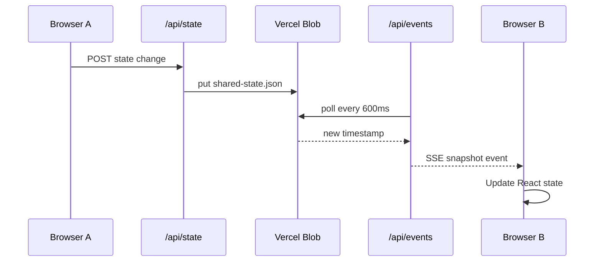

# Deployment — Real-Time Sync on Vercel

This app uses **Vite + React** on the client and **Vercel Serverless Functions** on the server. Real-time sync works in production without any database:

| Layer | Technology |
|-------|------------|
| Shared state | [Vercel Blob](https://vercel.com/docs/storage/vercel-blob) (JSON file, no DB) |
| Push updates | [Server-Sent Events (SSE)](https://developer.mozilla.org/en-US/docs/Web/API/Server-sent_events) via `/api/events` |
| Writes | HTTP POST to `/api/state` |
| Local dev | WebSocket relay (`server/ws-server.js`) |

> **Note:** Vercel Functions do not support WebSockets. SSE is the Vercel-native real-time pattern used here.

---

## File structure

```
testformapp/
├── api/
│   ├── events.js          # SSE stream — pushes state changes to all clients
│   ├── health.js          # Storage / sync readiness check
│   ├── state.js           # GET/POST shared application state
│   └── lib/
│       └── store.js       # Vercel Blob read/write + conflict handling
├── server/
│   ├── ws-server.js       # Local dev WebSocket server
│   └── ws-relay.js        # In-memory relay for dev
├── src/
│   ├── App.jsx            # UI + connection status indicator
│   └── hooks/
│       └── useRealtimeSync.js  # SSE/WebSocket hook with auto-reconnect
├── vercel.json            # Function timeouts + SPA rewrites
├── .env.example           # Environment variable reference
└── DEPLOYMENT.md          # This file
```

---

## Prerequisites

- Node.js 18+
- A [Vercel](https://vercel.com) account
- Git repository connected to Vercel

---

## Step 1 — Deploy the app

1. Push this repository to GitHub (or GitLab / Bitbucket).
2. In Vercel: **Add New Project** → import the repo.
3. Use default settings:
   - **Framework:** Vite
   - **Build command:** `npm run build`
   - **Output directory:** `build`
4. Deploy once (sync will show “Storage not linked” until Blob is connected).

---

## Step 2 — Connect Vercel Blob

1. Vercel Dashboard → your project → **Storage** → **Create Database / Store** → **Blob**.
2. Click **Connect to Project** and select this project.
3. Redeploy (Vercel injects `BLOB_READ_WRITE_TOKEN` automatically).

Verify:

```
https://YOUR-APP.vercel.app/api/health
```

Expected response:

```json
{
  "storageReady": true,
  "mode": "blob",
  "realtime": "sse",
  "hint": "Vercel Blob is configured. Live SSE sync should work."
}
```

---

## Step 3 — Test real-time sync

1. Open your production URL in two browser windows (or share the link with a teammate).
2. Confirm the header shows **Live sync** with a green dot.
3. Add a website or log a test in one window — the other should update within ~1 second without refresh.

---

## Environment variables

| Variable | Required | Description |
|----------|----------|-------------|
| `BLOB_READ_WRITE_TOKEN` | Production | Auto-set when Blob is linked to the project |
| `WS_PORT` | Local only | WebSocket dev server port (default `3001`) |
| `VITE_SYNC_MODE` | Optional | Force `websocket` (dev) or `sse` (production) |
| `VITE_WS_URL` | Optional | Custom WebSocket URL for dev |

Copy `.env.example` to `.env.local` for local overrides.

---

## Local development

```bash
npm install
npm run dev
```

This starts:

- Vite on `http://localhost:5173`
- WebSocket relay on `ws://localhost:3001` (proxied at `/ws`)

Local dev uses WebSockets automatically. To test the Vercel API path locally:

```bash
npx vercel dev
```

With Blob linked (or without `VERCEL` env for in-memory fallback), SSE + `/api/state` routes are available.

---

## How sync works



**Duplicate prevention:** Writes include a client ID and timestamp. The server only replaces stored state when the incoming snapshot is newer or has more data (see `shouldReplaceSnapshot` in `api/lib/store.js`).

**Reconnection:** SSE connections expire after 60s (Vercel function limit). The client hook reconnects automatically with exponential backoff (1s → 10s). A lightweight HTTP poll every 1.5s acts as a safety net.

**Disconnects:** When a user closes the tab, their SSE connection ends cleanly. No stale presence is kept server-side.

---

## Troubleshooting

| Symptom | Fix |
|---------|-----|
| “Storage not linked” in UI | Connect Vercel Blob and redeploy |
| `/api/health` → `storageReady: false` | Same as above |
| Updates only on refresh | Check `/api/events` in Network tab; ensure SSE stays open |
| Works in one tab, not two | Blob must be connected (in-memory is per-instance only) |

---

## Mapping to Next.js App Router

If you migrate to Next.js, the same logic maps directly:

| Current | Next.js equivalent |
|---------|-------------------|
| `api/state.js` | `app/api/state/route.js` |
| `api/events.js` | `app/api/events/route.js` (return `ReadableStream` for SSE) |
| `api/health.js` | `app/api/health/route.js` |
| `useRealtimeSync.js` | Same hook in `hooks/useRealtimeSync.js` |

No database is required in either stack — Vercel Blob + SSE is fully supported on Next.js Route Handlers.
